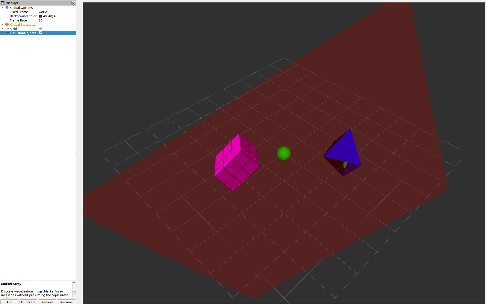

# Robot Collision Checking for ROS

A ROS package that wraps around [FCL](https://github.com/flexible-collision-library/fcl), a popular library in robotics for collision detection and proximity computation. This repository is inspired by [MoveIt's approach](https://moveit.ros.org/documentation/concepts/developer_concepts/) to interfacing ROS with FCL. However, `robot_collision_checking` is a lightweight alternative that does not require the entirety of a motion planning framework, like MoveIt, to expose FCL's collision and distance checking capabilities to ROS messages/types. 

The `robot_collision_checking` package can be utilised to perform distance and collision checking of objects by creating and maintaining a collision world and/or by using utility functions (see the [API Documentation](docs/api.md) for more information). This package can handle objects represented as [shape_msgs](http://wiki.ros.org/shape_msgs), 
[OctoMaps](https://github.com/OctoMap/octomap_msgs), and [VoxelGrids](https://github.com/ros-planning/navigation2/blob/main/nav2_msgs/msg/VoxelGrid.msg).

Implementations for the following ROS distros are available on different git branches of this repository:
- [ROS 1 Noetic](https://wiki.ros.org/noetic) on the `noetic-devel` branch,
- [ROS 2 Foxy](https://docs.ros.org/en/foxy/index.html) on the `foxy` branch, and 
- [ROS 2 Humble](https://docs.ros.org/en/humble/index.html) on the default `humble` branch.

The package was developed and tested on Ubuntu 20.04 for Noetic/Foxy and Ubuntu 22.04 for Humble. Nevertheless, any operating systems supported by the ROS distros available
to this package should also work.
We recommend using the default ROS 2 Humble implementation, as this continues to have ongoing support.

In terms of third-party software, this package requires:
 * [FCL](https://github.com/flexible-collision-library/fcl)
 * [libccd](https://github.com/danfis/libccd)
 * [OctoMap](https://octomap.github.io/) 
 * [Eigen](https://eigen.tuxfamily.org/dox/GettingStarted.html)

**Warning:** Older versions of FCL and `libccd` may already be installed on your system when installing ROS. These versions are incompatible with `robot_collision_checking`, so please ensure that these libraries are installed according to the [Installation](#installation) section of this repository.

## Installation

The following instructions will enable you to build the `robot_collision_checking` package within a [ROS 2 workspace](https://docs.ros.org/en/humble/Tutorials/Beginner-Client-Libraries/Creating-A-Workspace/Creating-A-Workspace.html) using `colcon build` (or `catkin build` if using ROS 1).

FCL and `libccd` may already be installed on your machine via your ROS distro, but these versions are likely outdated for the current repository's use. You will need to build these libraries from source, as described below.

### libccd

In a directory of your choice, run the following commands to build `libccd` from source:
```
git clone https://github.com/danfis/libccd.git
cd libccd && mkdir build && cd build
cmake -G "Unix Makefiles" -DENABLE_DOUBLE_PRECISION=ON ..
make
sudo make install
```

### FCL

**Important:** Before installing FCL, make sure to have `liboctomap-dev` installed, e.g.,
```
sudo apt install liboctomap-dev
```
as FCL will ignore building `OcTree` collision geometries otherwise (see [Issue #4](https://github.com/philip-long/robot_collision_checking/issues/4) for more information).

Once Octomap is installed, run the following commands in a directory of your choice to build an up-to-date version of FCL (i.e., later than [version 0.7.0](https://github.com/flexible-collision-library/fcl/releases/tag/0.7.0)) from source:

```
git clone https://github.com/flexible-collision-library/fcl.git
cd fcl && mkdir build && cd build
cmake ..
make
sudo make install
```

If there are errors when building `robot_collision_checking`, such as constants not being found, then you are probably still using an older version of FCL (prior to version 0.7.0).

### Workspace Setup

You can now clone the `robot_collision_checking` package into your ROS workspace's `src` directory and set it to the appropriate ROS distro implementation, e.g., by cloning as follows:
```
git clone --branch <branch-name> https://github.com/philip-long/robot_collision_checking.git
```
Where `<branch-name>` is either `humble`, `foxy`, or `noetic-devel`.

Don't forget to install any other system dependencies through `rosdep` after installing the above libraries, e.g., in the root directory of your ROS workspace run:
```
rosdep install --from-paths src --ignore-src -y
```

## Alternative - Docker Image

If you instead wish to explore the package in a Docker image, there is a `Dockerfile` available. After [installing docker](https://docs.ros.org/en/humble/How-To-Guides/Setup-ROS-2-with-VSCode-and-Docker-Container.html#install-docker), simply clone the repository or download the `Dockerfile` and
then run:
```
docker build --tag 'robot_collision_checking' . && docker run -it 'robot_collision_checking' bash
```

The Docker image is preconfigured with all the core libraries for `robot_collision_checking` (e.g., FCL, `libccd`, ROS, etc.). After building the image and starting the container, a ROS workspace `ros2_ws` will have been created and built with all the necessary dependencies. The final step is to source `ros2_ws` before testing out the package:
```
source /ros2_ws/install/setup.bash 
```

## Testing

You can run tests for the `robot_collision_checking` package as described in [this ROS 2 tutorial](https://docs.ros.org/en/humble/Tutorials/Intermediate/Testing/CLI.html). First compile the tests:
```
colcon test --ctest-args tests
```

And then examine the results:
```
colcon test-result --all --verbose
```

There are seven tests implemented in [interface_test.cpp](test/interface_test.cpp):
1. **TransformToFCL:** To validate the `Eigen::Affine3d` to `fcl::Transform3d` transformation method.
2. **AddRemove:** Asserts that a variety of [shape_msgs](http://wiki.ros.org/shape_msgs) and 
[OctoMaps](https://github.com/OctoMap/octomap_msgs) can be added/removed to a collision world.
3. **AddRemoveVoxelGrid:** Same as "AddRemove", except focused on [VoxelGrids](https://github.com/ros-planning/navigation2/blob/main/nav2_msgs/msg/VoxelGrid.msg).
4. **NullPtrCheck**: Tests whether the library handles `nullptr` function arguments correctly.
5. **CollisionCheck**: Validates that FCL collision-checking capabilities operate correctly for ROS types exposed through this package (e.g., `shape_msgs`).
6. **DistanceCheck**: Validates that FCL distance computations are correct for ROS types exposed through this package (e.g., `shape_msgs`).
7. **OctomapCollDistCheck**: A combination of tests for FCL collision and distance checking when using `robot_collision_checking` as an interface to handle OctoMaps as collision geometries.

If all seven tests pass, you can expect minimal output with a summary of "0 failures". If there are any errors, `test-result` will provide a detailed breakdown of the test(s) that failed and reason why in the terminal output. A test results file will also be stored in the `build/robot_collision_checking` directory of your ROS workspace (unless configured otherwise -- see [ROS tutorial docs](https://docs.ros.org/en/humble/Tutorials/Intermediate/Testing/CLI.html)).

## Examples

A toy example is provided in the `examples` directory and can be run as follows:
```
ros2 run robot_collision_checking fcl_interface_example
```
In a separate terminal, run an instance of [RViz](https://docs.ros.org/en/humble/Tutorials/Intermediate/RViz/RViz-User-Guide/RViz-User-Guide.html) and set the global fixed frame to "world" to visualize the collision world. You can install `rviz2` on Debian systems by running:
```
sudo apt install ros-$ROS_DISTRO-rviz2
```
If everything is set up correctly, you should see a view similar to:




Within the <i>fcl_interface_example</i> node, a few key pieces of functionality are provided:
- First, a collision world composed of different geometric shapes and types (meshes, planes, voxel grids, etc.) is constructed
and maintained using the package's interface.

        // Initialize the FCL collision world
        robot_collision_checking::FCLInterfaceCollisionWorld collision_world("world");
        bool success = initCollisionWorld(collision_world);

        bool initCollisionWorld(robot_collision_checking::FCLInterfaceCollisionWorld& world)
        {
            ...
            // Collection of objects to be added to the world
            std::vector<robot_collision_checking::FCLObjectPtr> fcl_objects;
            std::vector<int> object_ids = {0, 1, 2, 3, 4};
            ...
            // Adds the collection of FCL objects to the collision world
            // And returns whether this operation succeeded or failed
            return world.addCollisionObjects(fcl_objects, object_ids);
        }
&nbsp;&nbsp;&nbsp;&nbsp;&nbsp;&nbsp;&nbsp;&nbsp;&nbsp;&nbsp;&nbsp; where in the `initCollisionWorld` method, a collection of five FCL objects are added to the world:
- Second, the main publishing loop indicates how these different geometric types can be translated into [visualization_msgs/Marker](https://wiki.ros.org/rviz/DisplayTypes/Marker) 
messages for visualization in RViz.
- Finally, the example shows how the created collision world can be used to check for collisions between its constituent objects.

        std::vector<robot_collision_checking::FCLInterfaceCollisionObjectPtr> world_objects = 
            collision_world.getCollisionObjects();
        for (int i = 0; i < num_objects; /*i++*/)
        {
            auto world_obj = world_objects[i];
            std::string obj_type = world_obj->object->getTypeString();
            ...
            bool is_collision = collision_world.checkCollisionObject(
                world_obj->collision_id, collision_object_ids);
            if (is_collision)
            {
                for (int obj_id : collision_object_ids)
                {
                    RCLCPP_INFO(node->get_logger(), "%s with ID %d in collision with object with ID %d", 
                                obj_type.c_str(), world_obj->collision_id, obj_id);
                }
            }
            ...
        }

&nbsp;&nbsp;&nbsp;&nbsp;&nbsp;&nbsp;&nbsp;&nbsp;&nbsp;&nbsp;&nbsp; The output of the example node prints information about any objects currently in collision (as shown in the code snippet above).

Please refer to the [package's API documentation](docs/api.md) for more information about the code.

While this example only contains static objects, the package also works with dynamic objects. A more extensive use-case of this package that includes dynamic scenarios is provided in [constrained_manipulability](https://github.com/philip-long/constrained_manipulability).
Here, the `robot_collision_checking` interface checks for collisions and distances between environmental objects and a robot manipulator (based on the geometric shapes
present in its [URDF](https://docs.ros.org/en/humble/Tutorials/Intermediate/URDF/URDF-Main.html) model). 

<!-- ## Contributing

Contributions are always welcome! If you encounter any issues or need assistance, feel free to open a GitHub issue. 
We'd also love to hear how you're using the package—don't hesitate to share your experience or ideas with the community. -->
